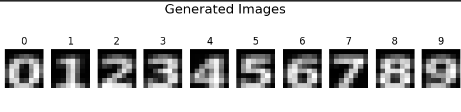

<p align="center">
	
</p>

<h1 align="center">Digit Creator</h1>

<p align="center">
	<strong>Generate digits using AI!</strong>
</p>

## 🚀 Overview

Welcome to **Digit Creator**! This program allows you to generate digits (0-9). The AI can take in numerous fonts to train the `model.pkl` model. The model can then be used to generate digits that will look like the fonts that it was trained on. The digits will be a kind of average/mix of the fonts that it trained on.

> [!NOTE]
> This program was created for Ubuntu, so you will have to adjust the `create_digits.py` program to change the default font paths to the correct paths on your system if you are not using a Linux OS.

## 🎨 Features

- **Mixing fonts:** The AI can take in numerous fonts to train the `model.pkl` model.
- **Storing the model:** The model is stored in a file called `model.pkl`, so that the program can efficiently load the model without training every task instantiation.

## 🛠️ Installation

To get started with the program, follow the steps below:

1. **Clone the repository**
```sh
git clone https://github.com/321BadgerCode/digit_creator.git
cd ./digit_creator/
```

## 📈 Usage

To use the program, follow the instructions below:

1. **Create the dataset**
```sh
python ./create_digits.py
```

2. **Run the program**
```sh
python ./main.py
```

## 📸 Screenshots

<p align="center">
	
</p>

## 📜 License

[LICENSE](./LICENSE)